<div align="center">
  <h1>🧠 DevBrain — Repository Memory System</h1>
  <p><em>Solving the “AI Hangover” by giving AI coding assistants persistent architectural memory.</em></p>
  
  
  
  
  

  <br />
  <!-- Demo GIF Placeholder: Replace '/docs/demo.gif' with a real recording of your app running before submitting to the hackathon! -->
  <!--  -->
</div>

<br />

## 🚨 The Problem

Traditional AI coding assistants suffer from the **"AI Hangover."** They are stateless engines that forget your repository's structure across sessions. 

As a result, developers face:
* **Lost Context:** Explaining the same custom architecture to the AI every single day.
* **Hallucinated Architecture:** The AI guessing framework patterns that don't actually exist in your codebase.
* **Onboarding Friction:** New team members struggling to query the codebase accurately because the AI lacks structural ground truth.
* **Stale Assumptions:** The AI giving answers based on standard boilerplate instead of your specific custom implementations.

---

## 💡 Solution Overview

**DevBrain** solves this by converting your raw codebase into a semantic Knowledge Graph. Developers upload a repository ZIP, construct a persistent memory graph, chat with the repository memory natively, reinforce useful answers, visually inspect the architecture, and seamlessly reset memory when migrating tasks.

### Architecture Workflow

```mermaid
flowchart LR
    A[React Upload UI] --> B[Spring Boot Orchestrator]
    
    subgraph Data Pipeline
        B --> C[Dataset Extraction]
        C --> D[Repository Cleaning]
    end
    
    subgraph Knowledge Engine
        D --> E[Cognee Memory Build]
        E --> F[Knowledge Graph]
    end
    
    subgraph Intelligence Layer
        F --> G[Spring AI Orchestrator]
        G --> H[Chat Interface]
        H --> I[Force Graph Visualizer]
    end
    
    subgraph Active Learning
        I --> J[Feedback Loop]
        J --> K[Memory Improvement]
        K --> L[Forget / Reset Context]
    end
```



---

## ✨ Core Features & Cognee Lifecycle Mapping

### 📦 Ingestion (`cognee.remember()`)
* **ZIP Ingestion & Code Cleaning**: Upload codebase `.zip` files. Spring Boot extracts and purges unwanted directories (such as `node_modules/`, `.git/`, and binary resources) before passing clean code structures to `cognee.remember()` to ingest them into the semantic database.
* **Knowledge Graph Construction**: Maps class definitions, interfaces, modules, and file dependencies automatically into a persistent knowledge graph.

### 💬 Conversational Repository Search (`cognee.recall()`)
* **Contextual Retrieval**: Chat with your repository using the interactive React UI. Under the hood, we invoke `cognee.recall()` to retrieve semantic structures and dependencies, grounding the AI's answer with precise repository context and file citations.

### 🧠 Feedback Learning Loop (`cognee.improve()`)
* **Thumbs-Up Reinforcement**: Rate AI answers. When clicking the thumbs-up button, a trigger invokes `cognee.improve()` (Enrich Mode) asynchronously on the backend, strengthening relationship weights in the knowledge graph based on user validation.

### 🧹 Context Reset (`cognee.forget()`)
* **Cascade Wiping**: Wipe existing database state when changing tasks. Clicking the "Reset Context" button invokes `cognee.forget()`, deleting the remote knowledge graph and purging local workspaces for a clean slate.

---

## 🏗️ System Architecture

1. **Frontend (React & Tailwind CSS):** A responsive split-view dashboard containing the conversational chat on the left and the interactive `react-force-graph-2d` architecture visualizer on the right.
2. **Backend Orchestrator (Spring Boot):** The central nervous system. Manages strict DTO validation, multipart file processing, robust global exception handling (`@ControllerAdvice`), and API Rate Limiting (Bucket4J).
3. **Memory Layer (Cognee Cloud):** The remote Knowledge Graph provider. Integrates via highly-resilient `WebClient` instances.
4. **AI Layer (Spring AI):** Orchestrates RAG (Retrieval-Augmented Generation) by synthesizing Cognee memory into constrained, low-temperature prompt templates for OpenAI/Anthropic models.

---

## 📂 Project Structure

```text
devbrain/
├── src/main/java/com/example/DevBrain/
│   ├── config/            # Cognee, Rate Limits, and App Properties
│   ├── controller/        # REST API Endpoints
│   ├── dto/               # Strict Request/Response Data Objects
│   ├── exception/         # GlobalExceptionHandler & Custom Exceptions
│   ├── model/             # JPA Entities (e.g., FeedbackEvent)
│   ├── repository/        # Spring Data JPA Repositories
│   └── service/           # Business Logic (Graph, Chat, Cleanup, Uploads)
├── src/main/resources/
│   └── application.properties # Spring Config & Secrets
└── build.gradle           # Dependencies (Bucket4j, Spring AI)
```

---

## 🔌 API Documentation

### `POST /api/datasets/upload`
Uploads and extracts a repository ZIP.
* **Request:** `multipart/form-data` (`file`, `datasetName`)
* **Response:** `{ "success": true, "message": "Extraction complete" }`

### `POST /api/chat/ask`
Ask the repository a question.
* **Request:** `{ "question": "How does auth work?", "datasetName": "my-repo" }`
* **Response:** `{ "answer": "...", "referencedFiles": ["src/Auth.java"] }`

### `POST /api/memory/improve`
Submit positive feedback to reinforce memory.
* **Request:** `{ "datasetName": "my-repo", "messageId": "msg_123", "positive": true }`
* **Response:** `{ "success": true, "enrichmentStatus": "TRIGGERED" }`

### `DELETE /api/memory/context/{dataset}`
Permanently destroy repository memory.
* **Response:** `{ "success": true, "message": "Memory purged" }`

### `GET /api/graph/{dataset}`
Fetch the structural repository map.
* **Response:** `{ "nodes": [...], "links": [...] }`

---

## 🚀 Local Setup

### Prerequisites
* Java 26
* Node.js 18+
* Cognee API Key
* OpenAI API Key

### 1. Backend Installation
```bash
cp .env.example .env
# adjust .env values as needed
./mvnw spring-boot:run
```

### 2. Frontend Installation (React)
```bash
cd frontend
npm install
npm run dev
```

## 🏭 Production Deployment

### Environment variables
- `PORT`: application port, defaults to `8080`
- `COGNEE_BASE_URL`, `COGNEE_API_KEY`: Cognee Cloud settings
- `COGNEE_FALLBACK_FAILURE_THRESHOLD`, `COGNEE_FALLBACK_COOLDOWN`, `COGNEE_FALLBACK_TIMEOUT`: fallback resilience controls
- `COGNEE_REQUEST_TIMEOUT`, `COGNEE_BATCH_SIZE`, `COGNEE_MAX_FILE_SIZE`: ingestion tuning
- `SUPABASE_URL`, `SUPABASE_ANON_KEY`, `SUPABASE_AUTH_ENABLED`: optional auth configuration
- `GROQ_API_KEY`, `GROQ_API_BASE`, `GROQ_MODEL`: optional chat model configuration

### Health and readiness
- `GET /api/health`
- `GET /api/system/status`
- `GET /api/deployment/info`
- `GET /actuator/health/liveness`
- `GET /actuator/health/readiness`

### Startup behavior
If the configured port is already occupied by a live DevBrain instance, the application reuses that listener instead of starting a duplicate process. If a different process holds the port, startup aborts with a diagnostic message after a short timeout.

### Fallback behavior
When Cognee Cloud becomes unavailable, uploads and searches fall back to local repository metadata while keeping the service responsive.

### Monitoring
Use the actuator endpoints above together with container health checks and application logs. The readiness endpoint reports Cognee availability, fallback state, and repository service health.

### Troubleshooting
- If the configured port is already in use, inspect the owning process or choose another port.
- If startup fails, verify `.env` values and port availability before retrying.
- If readiness is failing, inspect the Cognee and repository health details in `/api/system/status`.

---

## 🎥 Demo Instructions

1. **Upload:** Click "Upload Repository" and select a small to medium sized Java or JS project ZIP.
2. **Wait for Sync:** The backend will extract, clean, and pipe the codebase to Cognee.
3. **Chat:** Ask: *"Where are our database connection limits defined?"*
4. **Visualize:** Watch the right-hand panel. The AI will output the answer, and the specific config files will immediately glow and pulse on the Force Graph.
5. **Reset:** Click the red "Reset Context" button in the header to purge the data when finished.

---

## 🔮 Future Work

- [ ] **Streaming Responses:** Convert REST endpoints to Server-Sent Events (SSE) or WebSockets for real-time typing.
- [ ] **Multi-Repo Memory:** Cross-repository querying (e.g., querying Frontend and Backend microservices simultaneously).
- [ ] **Branch Comparison:** Graphing the architectural differences between `main` and `feature-branch`.
- [ ] **CI Integration:** Automatically sync memory on every GitHub commit.

---

## 📄 License

Distributed under the MIT License. See `LICENSE` for more information.
